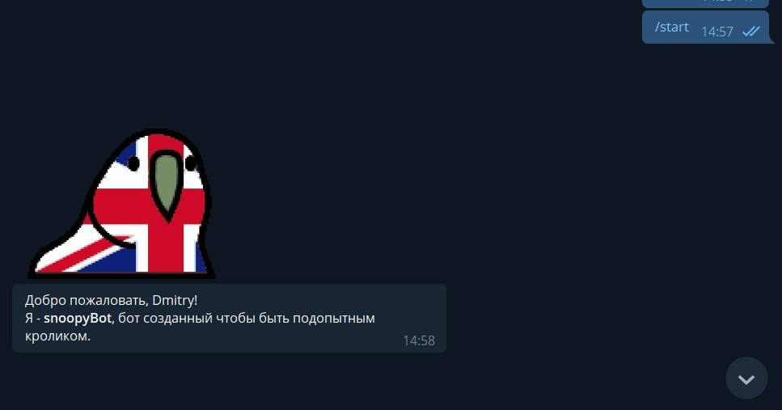

# Introduction

Hurray! This is the next step of working with encoder&decoder and convolutional layers. At this topic i am going to create a functional telegram bot, which will be able to work with user~s photos and find the most similar to them from database.

If you have not seen the previous part of my project, you should follow this [link](https://github.com/DmitryIo/animefaces) to get know about how all this works.

Ready? Go!

# Concepts

Bots are very popular today and their popilarity increases fastly. The most popular platform for implementation bots is Telegram. And that is exactly why i have chosed it.

Telegram provides useful API for their bots. And the library for working with it is [`pyTelegramBotAPI`](https://github.com/eternnoir/pyTelegramBotAPI). It is an intuitive thing, and i like it very much.

# Implementation

**1 Step**

Here we go! The first step of creating any telegram bot is to make an introduction. This is an example of how it works:

It takes from users data his name and send response by command `/start`, `Привет`, `Hello` and etc.

**2 Step**

Ok. Now the bot is able to answer first command. The next goal is to make an interactive bars for communicating with user. 
